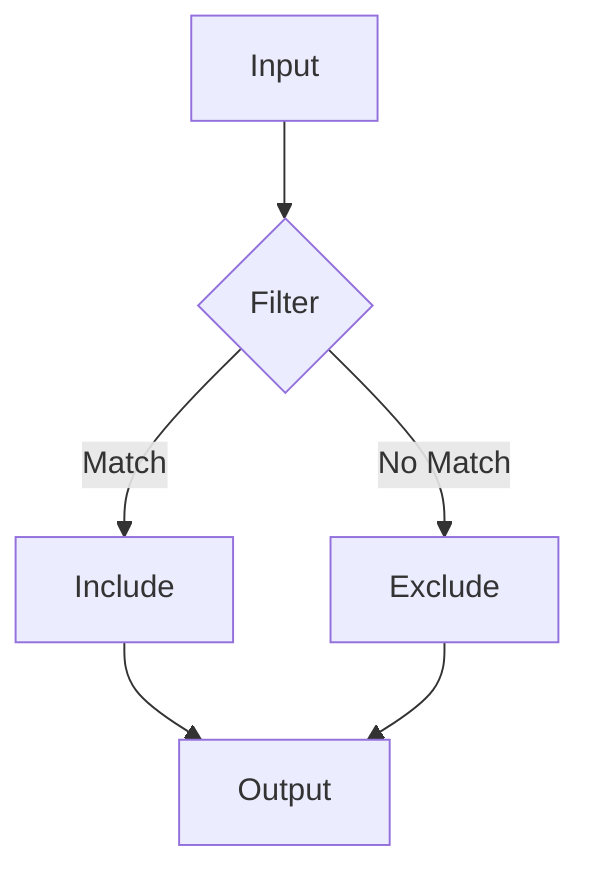

# Guia de Documentação

## Estrutura de Arquivos

```bash
docs/
├── api/                   # Documentação da API
│   ├── core/             # APIs do core
│   │   ├── diff.mdx      # Manipulação de diff
│   │   ├── filter.mdx    # Filtros
│   │   └── parser.mdx    # Parsing
│   ├── cli/              # APIs do CLI
│   │   ├── commands.mdx  # Comandos
│   │   └── options.mdx   # Opções
│   └── utils/            # APIs utilitárias
│       └── files.mdx     # Operações com arquivos
│
├── guides/               # Guias de uso
│   ├── quickstart.mdx    # Guia inicial
│   ├── filtering.mdx     # Guia de filtros
│   └── formatting.mdx    # Guia de formatação
│
└── examples/            # Exemplos práticos
    ├── basic.mdx        # Uso básico
    ├── advanced.mdx     # Uso avançado
    └── integration.mdx  # Integrações
```

## Frontmatter

Todo arquivo MDX deve começar com frontmatter:

```yaml
---
title: 'Título da Página'
description: 'Breve descrição que aparece nos resultados de busca'
---
```

Opções adicionais:
```yaml
---
icon: 'nome-do-icone'        # Ícone da página
sidebarTitle: 'Título Menu'  # Título específico para sidebar
openapi: 'caminho/spec.yml'  # Para páginas de API
api: 'método e endpoint'     # Para documentação de API
---
```

## Componentes MDX

### Cards

<CardGroup>
  <Card title="Instalação" icon="download" href="/guides/installation">
    Como instalar e configurar o Git Scope
  </Card>
  <Card title="API" icon="code" href="/api/core/diff">
    Referência completa da API
  </Card>
</CardGroup>

### Tabs

<Tabs>
  <Tab title="npm">
    ```bash
    npm install git-scope
    ```
  </Tab>
  <Tab title="pip">
    ```bash
    pip install git-scope
    ```
  </Tab>
</Tabs>

### Callouts

<Info>
  Informação importante que o usuário deve saber.
</Info>

<Warning>
  Aviso sobre possíveis problemas.
</Warning>

<Note>
  Nota adicional ou dica útil.
</Note>

<Tip>
  Sugestão para melhor uso.
</Tip>

## Código e Sintaxe

### Blocos de Código

```python
from git_scope.core.diff import GitScope

scope = GitScope()
diff = scope.parse_diff("diff.patch")
```

Com título e números de linha:

```python showLineNumbers title="examples/basic.py"
from git_scope.core.diff import filter_diff

def process_diff(diff_content: str) -> str:
    """Filter diff content based on rules."""
    return filter_diff(diff_content, patterns=["*.py"])
```

### Destacando Linhas

```python {1,3-4}
from git_scope.core.diff import GitScope  # Linha destacada
scope = GitScope()
diff = scope.parse_diff("diff.patch")  # Linhas destacadas
filtered = scope.filter(diff)
```

## Imagens e Diagramas

### Imagens Responsivas

<Frame>
  
</Frame>

### Diagramas Mermaid



## API Reference

### Parâmetros

<ParamField path="patterns" type="List[str]" required>
  Lista de padrões para filtragem de arquivos
</ParamField>

<ParamField path="format" type="str" default="compact">
  Formato de saída: 'compact' ou 'detailed'
</ParamField>

### Exemplos de Uso

<CodeGroup>
  <CodeBlock title="Básico">
    ```python
    from git_scope.core.diff import filter_diff
    
    result = filter_diff(content, patterns=["*.py"])
    ```
  </CodeBlock>
  
  <CodeBlock title="Avançado">
    ```python
    from git_scope.core.diff import filter_diff
    from git_scope.formatters import DetailedFormatter
    
    result = filter_diff(
        content,
        patterns=["*.py", "!tests/*"],
        formatter=DetailedFormatter()
    )
    ```
  </CodeBlock>
</CodeGroup>

## Melhores Práticas

1. **Organização**
   - Siga a estrutura de diretórios
   - Mantenha documentos relacionados juntos
   - Use nomes descritivos

2. **Conteúdo**
   - Seja conciso e claro
   - Forneça exemplos práticos
   - Mantenha a documentação atualizada

3. **Formatação**
   - Use componentes MDX apropriadamente
   - Mantenha consistência no estilo
   - Verifique a renderização