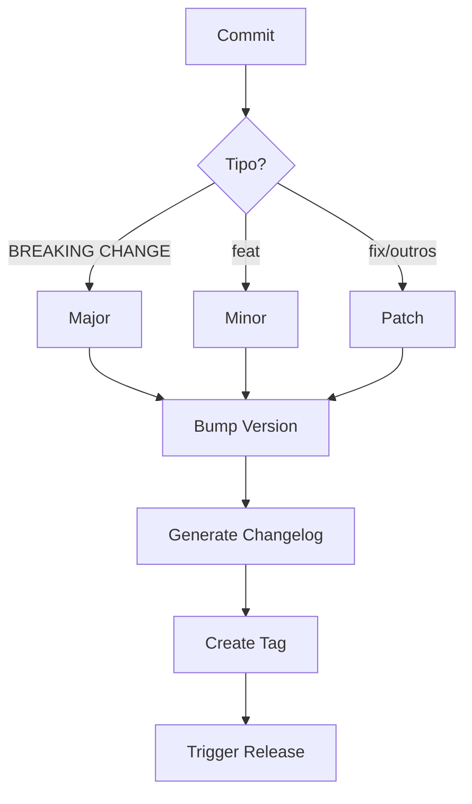
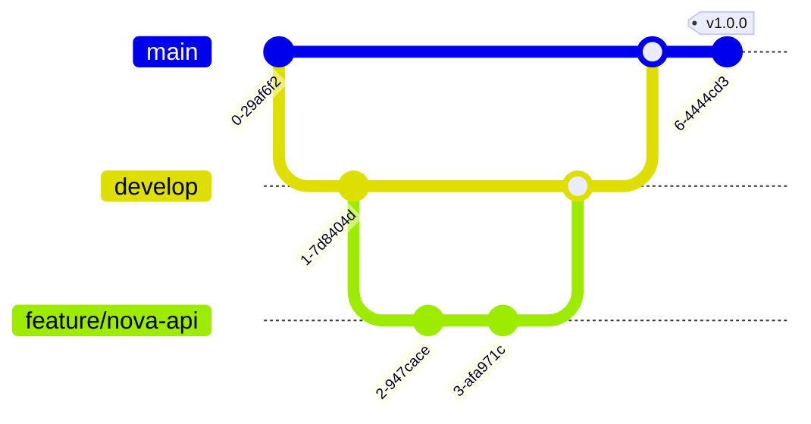
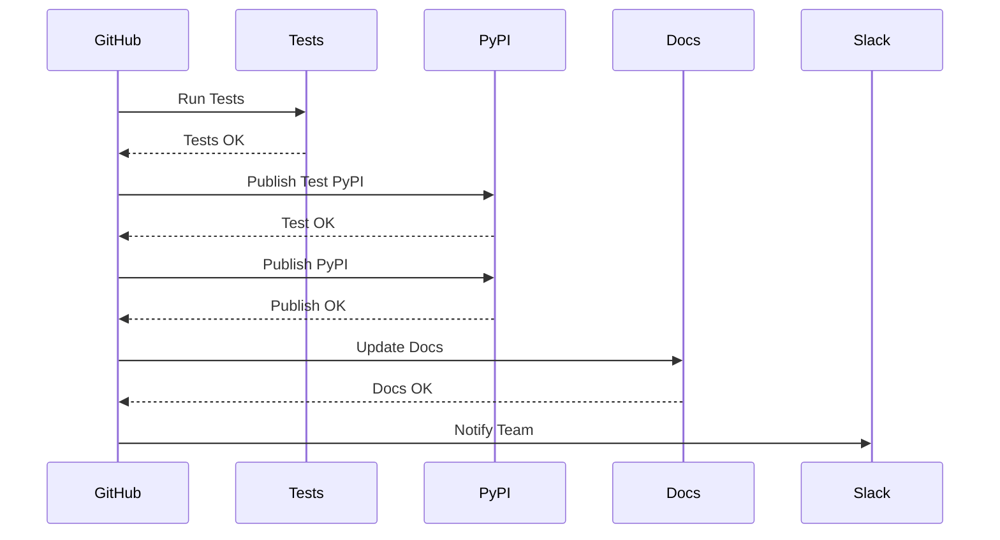

# Fluxo de Versionamento e Release

Este documento explica o processo automatizado de versionamento e release da biblioteca, desde o desenvolvimento até a publicação.

## Visão Geral

O processo é dividido em duas partes principais:
1. Controle de Versão: Gerencia automaticamente as versões baseado nos commits
2. Release: Automatiza a publicação de novas versões

<Frame>
  
</Frame>



## 1. Desenvolvimento

### 1.1 Branches



### 1.2 Commits

Usamos [Conventional Commits](https://www.conventionalcommits.org/) para padronizar as mensagens:

```bash
# Nova funcionalidade
git commit -m "feat: adiciona suporte a filtros avançados"

# Correção de bug
git commit -m "fix: corrige parsing de argumentos"

# Breaking change
git commit -m "feat!: altera API de filtros"
# ou
git commit -m "feat: altera API de filtros

BREAKING CHANGE: Nova API incompatível com versão anterior"

# Documentação
git commit -m "docs: atualiza exemplos de uso"

# Performance
git commit -m "perf: otimiza algoritmo de diff"

# Refatoração
git commit -m "refactor: reorganiza módulos"
```

## 2. Controle de Versão Automático

### 2.1 Quando é Acionado

O controle de versão automático é acionado em dois casos:
1. Push direto para `main` ou `develop`
2. Pull Request mesclado em `main` ou `develop`

### 2.2 Regras de Versionamento

Seguimos [Semantic Versioning](https://semver.org/):

```
MAJOR.MINOR.PATCH[-PRERELEASE][+BUILD]
```

- **MAJOR (X.0.0)**: Breaking changes
  - Commits com `BREAKING CHANGE:`
  - Commits com `!:` (ex: `feat!:`)
  
- **MINOR (0.X.0)**: Novas funcionalidades
  - Commits começando com `feat:`
  
- **PATCH (0.0.X)**: Correções e melhorias
  - Commits começando com:
    - `fix:`
    - `docs:`
    - `style:`
    - `refactor:`
    - `perf:`
    - `test:`
    - `chore:`

### 2.3 Processo Automático

1. **Análise de Commits**
   ```bash
   # Obtém commits desde última tag
   git log $(git describe --tags --abbrev=0)..HEAD
   ```

2. **Determinação de Versão**
   ```python
   if has_breaking_change:
       bump = "major"
   elif has_feature:
       bump = "minor"
   elif has_fix_or_chore:
       bump = "patch"
   ```

3. **Atualização de Versão**
   - Atualiza `pyproject.toml`
   - Atualiza `src/__init__.py`
   - Gera novo CHANGELOG
   - Cria commit de release
   - Cria tag de versão

## 3. Processo de Release

### 3.1 Quando é Acionado

O processo de release é acionado quando uma nova tag é criada:
```bash
v1.2.3            # Release normal
v1.2.3-beta.1     # Pre-release
```

### 3.2 Etapas do Release

<Frame>
  
</Frame>



1. **Validação**
   - Verifica formato da tag
   - Confirma que versão corresponde ao `pyproject.toml`

2. **Testes**
   - Executa testes em múltiplas versões do Python:
     - Python 3.8
     - Python 3.9
     - Python 3.10
     - Python 3.11

3. **Build**
   - Constrói pacote usando Poetry
   - Gera arquivos `.whl` e `.tar.gz`
   - Valida artefatos gerados

4. **Publicação Test PyPI**
   - Publica no Test PyPI
   - Aguarda disponibilidade
   - Testa instalação
   - Verifica importação

5. **Publicação PyPI**
   - Publica versão no PyPI oficial
   - Verifica publicação

6. **GitHub Release**
   - Cria release no GitHub
   - Anexa artefatos
   - Inclui CHANGELOG
   - Marca como pre-release se for beta/alpha

7. **Documentação**
   - Valida documentação
   - Atualiza documentação no Mintlify
   - Publica nova versão

8. **Notificação**
   - Notifica equipe via Slack
   - Inclui status e links

## 4. Configuração

### 4.1 Secrets Necessários

```bash
# GitHub
GITHUB_TOKEN          # Automático

# PyPI
PYPI_TOKEN           # Token do PyPI
TEST_PYPI_TOKEN      # Token do Test PyPI

# Documentação
MINTLIFY_TOKEN       # Token do Mintlify

# Notificações
SLACK_BOT_TOKEN      # Token do Slack
```

### 4.2 Arquivos de Configuração

1. **Version Control**
   ```yaml
   # .github/workflows/version-control.yml
   name: Version Control
   on:
     push:
       branches: [main, develop]
     pull_request:
       types: [closed]
   ```

2. **Release**
   ```yaml
   # .github/workflows/release.yml
   name: Release
   on:
     push:
       tags: ['v[0-9]+.[0-9]+.[0-9]+*']
   ```

3. **Changelog**
   ```toml
   # .github/cliff.toml
   [changelog]
   header = "# Changelog"
   body = """
   ## [{{ version }}] - {{ timestamp | date(format="%Y-%m-%d") }}
   
   ### {{ group }}
   
   - {{ commit.message }}
   
   
   """
   ```

## 5. Exemplos Práticos

### 5.1 Desenvolvimento Normal

```bash
# Criar feature
git checkout -b feature/nova-api

# Desenvolver com commits convencionais
git commit -m "feat: adiciona endpoint de busca"
git commit -m "test: adiciona testes do endpoint"
git commit -m "docs: documenta novo endpoint"

# Criar Pull Request
# Após aprovação e merge:
# - Versão é incrementada (MINOR neste caso)
# - Tag v1.1.0 é criada
# - Release é publicado
```

### 5.2 Breaking Change

```bash
# Desenvolver mudança incompatível
git commit -m "feat!: refatora API de autenticação"

# Após merge:
# - Versão MAJOR é incrementada
# - Tag v2.0.0 é criada
# - Release é publicado com aviso de breaking change
```

### 5.3 Correção de Bug

```bash
# Corrigir bug em produção
git checkout -b fix/auth-error
git commit -m "fix: corrige validação de token"

# Após merge:
# - Versão PATCH é incrementada
# - Tag v2.0.1 é criada
# - Release é publicado
```

## 6. Troubleshooting

### 6.1 Versão Incorreta

Se a versão não incrementar corretamente:
1. Verifique formato das mensagens de commit
2. Confirme que commits estão desde última tag
3. Verifique permissões do GitHub Token

### 6.2 Falha no Release

Se o release falhar:
1. Verifique todos os tokens (PyPI, Mintlify, Slack)
2. Confirme que versão no código corresponde à tag
3. Verifique logs de teste em todas versões Python

### 6.3 Rollback

Para reverter um release problemático:
```bash
# Remover tag local e remota
git tag -d v1.2.3
git push origin :refs/tags/v1.2.3

# Criar nova tag com versão corrigida
git tag -a v1.2.4 -m "Release version 1.2.4"
git push origin v1.2.4
```

## 7. Melhores Práticas

### 7.1 Commits

1. **Seja Descritivo**
   ```bash
   # Ruim
   git commit -m "fix: corrige bug"
   
   # Bom
   git commit -m "fix: corrige validação de token JWT expirado"
   ```

2. **Use o Corpo do Commit**
   ```bash
   git commit -m "feat: adiciona suporte a OAuth" -m "
   - Implementa fluxo de autorização OAuth 2.0
   - Adiciona endpoints /auth e /callback
   - Suporta providers: Google, GitHub
   "
   ```

### 7.2 Pull Requests

1. **Título Claro**
   ```
   feat: Implementa autenticação OAuth
   ```

2. **Descrição Detalhada**
   ```markdown
   ## Mudanças
   - Adiciona suporte OAuth 2.0
   - Implementa novos endpoints
   - Atualiza documentação
   
   ## Testes
   - [ ] Testes unitários
   - [ ] Testes de integração
   - [ ] Testes E2E
   ```

### 7.3 Releases

1. **Pre-releases**
   ```bash
   # Alpha: desenvolvimento inicial
   v1.0.0-alpha.1
   
   # Beta: feature-complete, pode ter bugs
   v1.0.0-beta.1
   
   # RC: candidato a release
   v1.0.0-rc.1
   ```

2. **Release Notes**
   ```markdown
   ## Novidades
   - Autenticação OAuth 2.0
   - Suporte a múltiplos providers
   
   ## Breaking Changes
   - Removido suporte a auth básica
   
   ## Correções
   - Validação de token JWT
   ```